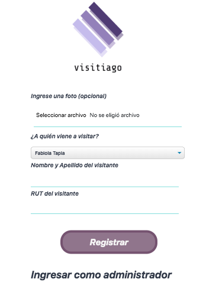

# [Hackaton-visitors](https://aleisabl.github.io/hackaton-visitors/public/index.html)

Viviendo en un mundo digitalizado, en donde la tecnología se ha vuelto un factor importante con el ahorro de tiempo en tareas y almacenamiento, Visitiago es una herramienta importante para agilizar el registro de entradas de visitas en cualquier empresa. 

Visitiago permite al usuario poder registrarse sin necesidad de loguearse o mantener una cuenta para poder marcar su ingreso. 
Nuestra aplicación cuenta con una base de datos, que almacenará la información que sea ingresada por nuestros usuarios visitantes. De igual forma, entrega a través de una cuenta de administrador el registro de los visitantes. 

Visitiago también permite almacenar una fotografía de la cédula de identidad de nuestros visitantes para poder tener un control formal de las visitas obtenidas. 

Sin más, te invitamos a ingresar a nuestra aplicación y probarla [aquí](https://aleisabl.github.io/hackaton-visitors/public/index.html) , el feedback es más que bienvenido.

## Funciones principales

 * Permitir al usuario visitante registrarse con sus datos personales, incluyendo su foto.
 * Permitir al usuario visitante seleccionar a la persona a quien viene a visitar.
 * Permite al usuario administrador visualizar la data de los visitantes, incluyendo la fecha y hora de registro de cada uno.

 ## Conclusiones

 * Se realizaron pruebas de usuario y se confirma la rapidez para el almacenamiento de registro de visitantes en los distintos establecimientos.

 * Permite a los administradores tener un registro de los visitantes.

## Autores
Este proyecto fue realizado por `Alexandra Fernández`, `Karen Quezada` y `Maria José Marquez` para `Laboratoria, Chile` en una hackaton de 3 días.
